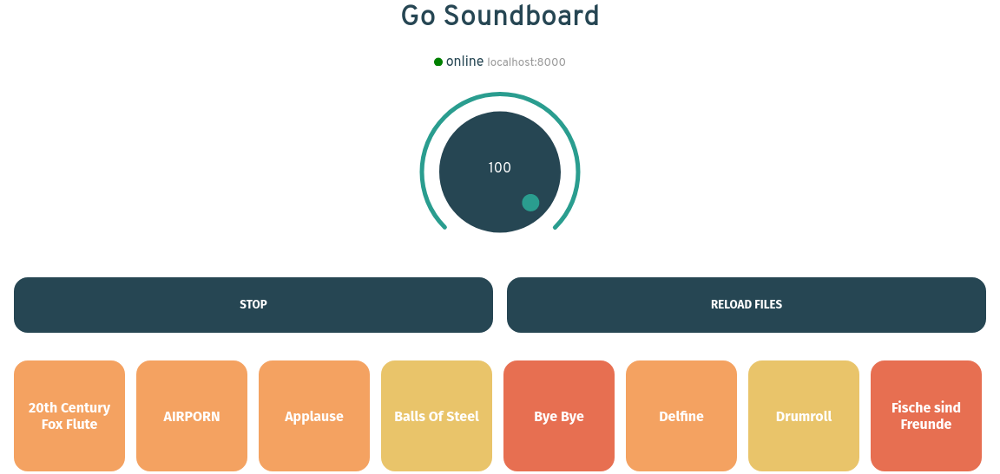

[](https://goreportcard.com/report/github.com/kevinschweikert/go-soundboard)



 A cross-plattform Soundboard written in Go and Svelte 

## Dependencies

- [Nodejs](https://nodejs.org/en/) (Tested with Version 10)
- [Go](https://golang.org/) (Tested with Version 1.14)
- [Beep](https://github.com/faiface/beep) ( It uses [Oto](https://github.com/hajimehoshi/oto) under the hood, so check out the dependencies if something's not working with your audio playback )  
- [Gorilla Websocket](https://github.com/gorilla/websocket)

## Build

### Server

```bash
make server
```

### Webinterface

```bash
make ui
```

## Development

```bash
make dev
```


## Usage

```bash
   -buff int
        Output buffer size in bytes (default 256)
  -path string
        path to sound files (default "./sounds")
  -port int
        Port to listen for the webinterface (default 8000)
  -samplerate int
        Output Samplerate in Hz (default 48000)
 ```


POSSIBLE FUTURE FEATURES:

- [ ] Create API for audio files and listen to them from the browser
- [ ] Store volume and Favourite Sounds in Browser local storage