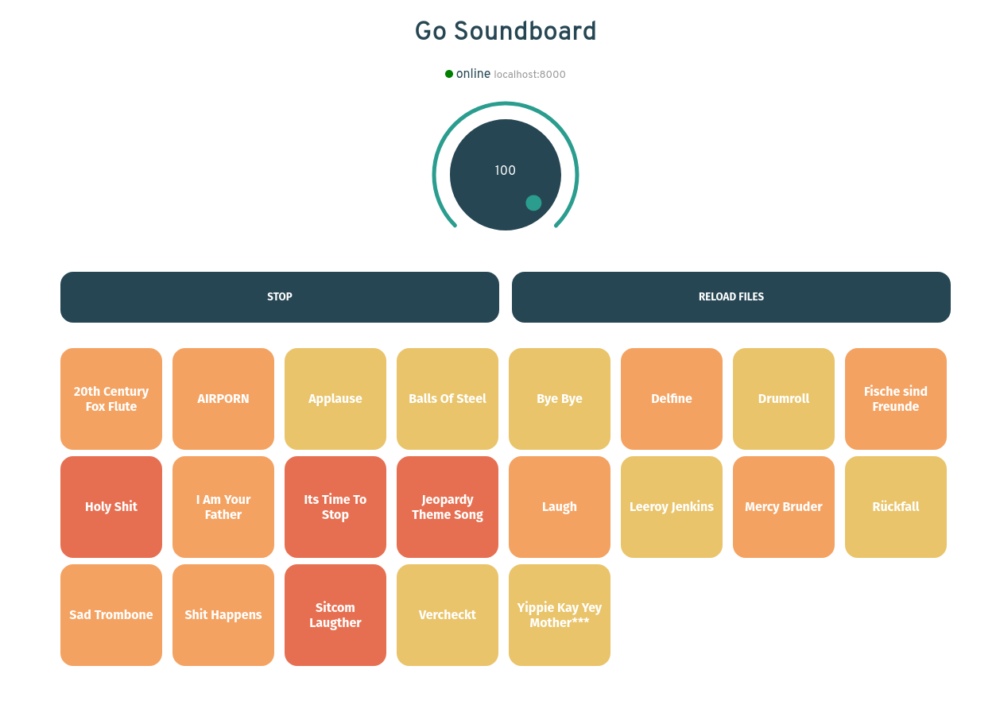

A Soundboard written in Go

## Dependencies

https://github.com/faiface/beep
https://github.com/gorilla/websocket

## Installation

### Server

Go Version >= 1.13

```bash
make server
```

### Webinterface

Nodejs Version >= 10

```bash
make ui
```

## Command Line Flags

 ```bash
  -buff int
        Output buffer size in bytes (default 256)
  -path string
        path to sound files (default "./sounds")
  -samplerate int
        Output Samplerate in Hz (default 48000)
 ```


TODO:

- [ ] Rewrite packages so they become seperate / unaware from each other
- [ ] Rethink error handling and sending
- [ ] Broadcast errors or send them to a specific client
- [ ] Sync volume setting to clients

POSSIBLE FEATURES:

- [ ] Create API for audio files and listen to them from the browser
- [ ] Store volume and Favourite Sounds in Browser local storage